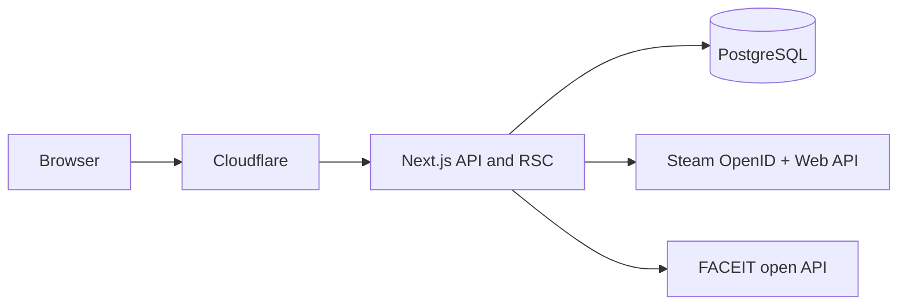

# Full security review (savecounterstrike)

This document is an adversarial review of the repository as it exists today. Severity uses practical exploitability and impact for this app (petition/community site).

---

## Architecture snapshot




- **Auth:** Custom Steam OpenID flow (`[src/app/api/auth/steam/callback/route.ts](src/app/api/auth/steam/callback/route.ts)`) calls `verifySteamLogin` then server-side `signIn("steam", …)` (`[src/lib/steam.ts](src/lib/steam.ts)`).
- **Sessions:** JWT strategy in `[src/lib/auth.ts](src/lib/auth.ts)`; **no** `[...nextauth]` route re-exporting `handlers` — the Credentials provider is only reachable via that server `signIn` path (good defense-in-depth; not exposed as a public credential POST endpoint).

---

## Critical / high

### 1. Unauthenticated read of non-public articles (IDOR)

`[src/app/api/articles/[id]/route.ts](src/app/api/articles/[id]/route.ts)` `GET` returns **any** article by `id` with **no** `published` check and **no** admin session requirement.

```13:27:src/app/api/articles/[id]/route.ts
export async function GET(
  _request: NextRequest,
  { params }: { params: Promise<{ id: string }> }
) {
  const { id } = await params;
  const article = await db.article.findUnique({
    where: { id },
    include: { tags: true },
  });
  // ...
  return NextResponse.json(article);
}
```

**Impact:** Anyone who can guess or obtain a draft article UUID can read full content before publication (confidentiality breach). Same likely applies if the public UI only lists published posts but the API does not.

**Fix direction:** Require `published === true` for anonymous users; allow drafts only for `requireAdminApi()` / session role.

---

### 2. Unauthenticated read of moderated opinions (IDOR)

`[src/app/api/opinions/[id]/route.ts](src/app/api/opinions/[id]/route.ts)` `GET` returns **any** opinion by `id` with **no** `status` filter.

**Impact:** Pending, rejected, or hidden opinions remain readable via direct API access if the ID is known or enumerated (policy/confidentiality).

**Fix direction:** For non-privileged callers, return 404 unless `status === "APPROVED"` (or mirror whatever the public listing allows). Moderators/admins can use a separate query or `auth`-aware branch.

---

### 3. FACEIT stats integrity — client-controlled values

`[src/app/api/user/faceit/route.ts](src/app/api/user/faceit/route.ts)` trusts `faceitLevel` and `faceitElo` from the **JSON body** after a session check. There is **no** server-side re-fetch from FACEIT or HMAC tying the payload to FACEIT’s response.

**Impact:** Any authenticated user can `POST` arbitrary ELO/level (reputation/ranking fraud) with `curl`.

**Fix direction:** Prefer server-side verification (if networking allows), signed attestation from the client flow, or drop persistence of raw ELO and only store non-gameable signals. At minimum, cap sanity checks and rate-limit; ideally verify against FACEIT on the server or remove the endpoint’s trust in body data.

---

### 4. Public FACEIT API key in the browser bundle

`[src/components/auth/FaceitSync.tsx](src/components/auth/FaceitSync.tsx)` embeds a **literal** `FACEIT_CLIENT_KEY` UUID used as `Bearer` from the client.

**Impact:** Key is extractable from built JS (quota abuse, automated scraping, potential ToS issues). Not a server secret, but still an **asset** to protect.

**Fix direction:** Use env-based `NEXT_PUBLIC_`* if it must be public, rotate if leaked, monitor FACEIT dashboard for abuse; long-term, proxy through your backend with secret key if FACEIT allows server-only flows for your use case.

---

## Medium

### 5. Weak Content-Security-Policy

`[next.config.ts](next.config.ts)` sets `script-src 'self' 'unsafe-inline' 'unsafe-eval'` and `connect-src 'self' https:` (any HTTPS origin).

**Impact:** CSP does little to stop script injection if another bug appears; broad `connect-src` aids exfiltration from an XSS. This is a **defense-in-depth** gap, not a standalone vulnerability.

---

### 6. Rate limiting: trust model and scaling

`[src/lib/rate-limit.ts](src/lib/rate-limit.ts)` keys by first IP in `x-forwarded-for` (and similar in `[src/app/api/contact/route.ts](src/app/api/contact/route.ts)` without splitting).

**Impact:** If the app is not strictly behind a trusted reverse proxy that **overwrites** `X-Forwarded-For`, clients can spoof IPs and bypass limits. In-memory stores do not sync across multiple Node instances (horizontal scaling bypass).

---

### 7. Inconsistent admin authorization style

Mix of `[requireAdminApi](src/lib/admin.ts)`, manual `session.user.role`, and `(session?.user as any)?.role` (e.g. media routes per earlier scan).

**Impact:** No current gap proven from this alone, but **higher regression risk** when adding routes.

---

### 8. Error / metadata leakage

Several routes return Zod `flatten()` / `fieldErrors` to clients (useful for forms; also reveals schema structure). No stack traces observed in API paths reviewed; `[src/app/api/auth/steam/callback/route.ts](src/app/api/auth/steam/callback/route.ts)` redirects with generic `error` query params (good).

---

## Low / informational

### 9. `proxy.ts` admin block is a no-op

`[src/proxy.ts](src/proxy.ts)` documents admin protection but the `/admin` branch is empty; enforcement is in `[src/app/(admin)/admin/layout.tsx](src/app/(admin)`/admin/layout.tsx) (server redirect). **Impact:** No direct bypass by itself; unauthenticated users still hit the layout and get redirected (extra work / minor info that `/admin` exists).

---

### 10. Docker dev compose exposure

`[docker-compose.yml](docker-compose.yml)` (per scan): Postgres on host port **5432** with a **fixed dev password**. Risk if developers run this on untrusted networks.

---

### 11. Next.js `images.remotePatterns` wildcard

`[next.config.ts](next.config.ts)` uses `hostname: "**"` for images.

**Impact:** Allows loading images from any HTTPS host (tracking, phishing imagery in user-controlled URLs if those URLs are rendered). Harden if URLs are user-controlled in UI.

---

### 12. HTML email content in contact form

`[src/app/api/contact/route.ts](src/app/api/contact/route.ts)` interpolates user fields into HTML email. Zod constrains length; raw HTML in `message` is not interpreted as HTML in most clients for the `text` part, but the HTML part uses string concatenation—typical **recipient-side** mail client risk, low for the web app itself.

---

## Positive controls (what is done well)

- **Steam OpenID** verification against Valve before session creation (`[verifySteamLogin](src/lib/steam.ts)`).
- **Banned users** blocked at callback before `signIn` (`[src/app/api/auth/steam/callback/route.ts](src/app/api/auth/steam/callback/route.ts)`).
- **No** `rehype-raw`; HTML paths use **sanitize-html** / **DOMPurify** (`[src/lib/sanitize.ts](src/lib/sanitize.ts)`, `[SafeHtml.tsx](src/components/opinions/SafeHtml.tsx)`, `[ArticleContent.tsx](src/components/blog/ArticleContent.tsx)`).
- **Upload** path uses type/size/magic-byte checks (referenced in API review; worth keeping strict).
- **Security headers:** `X-Frame-Options`, `X-Content-Type-Options`, `Referrer-Policy` in `[src/proxy.ts](src/proxy.ts)`; CSP present (though permissive).
- `**.env` in `.gitignore`**; compose files avoid committing prod secrets (structure-only).
- **Docker prod** image runs as non-root user (`nextjs`) per `[Dockerfile.prod](Dockerfile.prod)` scan.

---

## Suggested remediation order (after you approve implementation work)

1. Fix **article** and **opinion** GET authorization to match public visibility rules.
2. Fix **FACEIT** persistence (integrity + optional key handling).
3. Tighten **CSP** incrementally (remove `unsafe-eval` if possible; narrow `connect-src`).
4. Harden **rate limiting** (trusted IP from `CF-Connecting-IP` / single proxy hop; Redis or similar if multi-instance).
5. Normalize **admin checks** to shared helpers only; remove `as any` where possible.
6. Review **Next/Image** patterns** vs user-supplied URLs.

---

## Scope notes

- **Dependency CVEs:** Not audited here; run `npm audit` / Dependabot / OSV regularly.
- **Penetration testing:** This is static code review; runtime config (e.g. `AUTH_SECRET`, cookie `Secure`/`SameSite` in production) should be verified on the deployed host.

